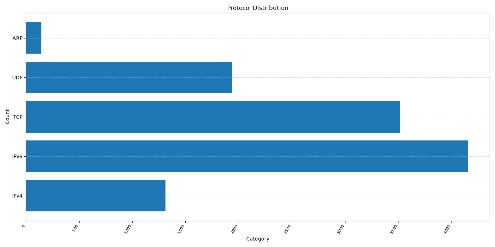
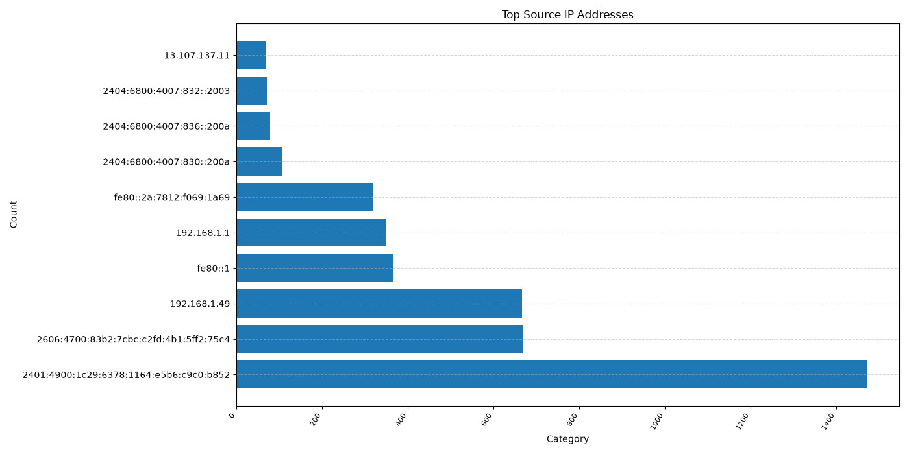
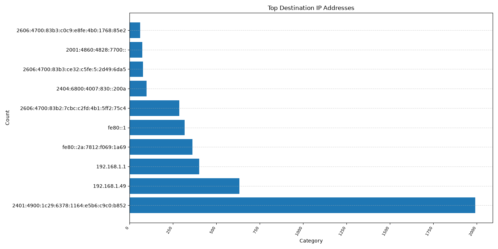
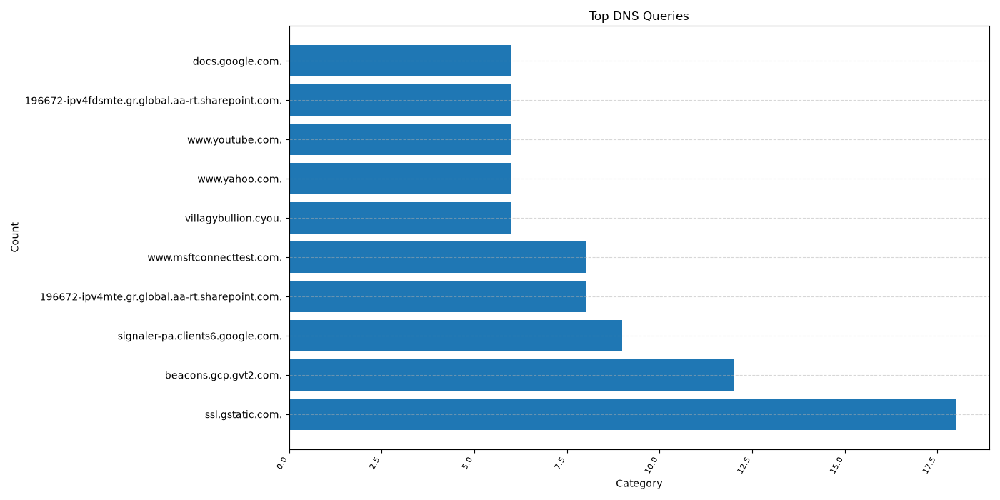
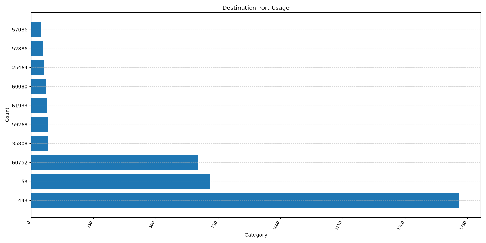

# 🛡️ WiFi Network Security Analysis and Monitoring

A Python-based cybersecurity project that analyzes captured WiFi network traffic, identifies potential security threats, generates graphical reports, and performs network discovery using Nmap.

---

## 📌 Project Overview

This project captures and analyzes WiFi network traffic using **Wireshark** and **Scapy**. It provides detailed insights into network communication by examining protocols, IP addresses, DNS requests, ports, packet sizes, and potential security threats.

The project also generates CSV reports, graphical visualizations, and a detailed security report for further analysis.

---

# ✨ Features

- 📡 WiFi Packet Capture Analysis
- 📊 Protocol Analysis (IPv4, IPv6, TCP, UDP, ARP)
- 🌐 Source & Destination IP Analysis
- 📦 Packet Size Statistics
- 🔍 DNS Query Analysis
- 🔐 Port Analysis
- 🚨 Threat Detection Engine
- 📄 Automatic CSV Report Generation
- 📈 Graph Generation
- 📑 Security Report Generation
- 🌍 Network Discovery using Nmap
- 🔓 Open Port Scanning
- 🖥️ Service Detection

---

# 🛠️ Technologies Used

| Technology | Purpose |
|------------|---------|
| Python | Programming Language |
| Scapy | Packet Analysis |
| Wireshark | Packet Capture |
| Nmap | Network Discovery & Port Scanning |
| Matplotlib | Graph Generation |
| CSV | Report Generation |

---

# 📂 Project Structure

```text
WiFi-Network-Security-Analysis/

├── data/
│
├── docs/
│
├── images/
│   ├── protocol_distribution.png
│   ├── top_source_ips.png
│   ├── top_destination_ips.png
│   ├── dns_queries.png
│   └── port_distribution.png
│
├── Screenshots/
│
├── notebook/
│
├── presentation/
│
├── reports/
│   ├── protocol_summary.csv
│   ├── source_ip_summary.csv
│   ├── destination_ip_summary.csv
│   ├── dns_summary.csv
│   ├── port_summary.csv
│   └── security_report.txt
│
├── scripts/
│
├── README.md
├── requirements.txt
└── .gitignore
```

---

# ⚙️ Installation

Clone the repository

```bash
git clone https://github.com/YOUR_USERNAME/WiFi-Network-Security-Analysis.git
```

Move into the project folder

```bash
cd WiFi-Network-Security-Analysis
```

Install dependencies

```bash
pip install -r requirements.txt
```

---

# ▶️ Run the Project

```bash
python scripts/main.py
```

---

# 📊 Generated Reports

The program automatically generates:

- protocol_summary.csv
- source_ip_summary.csv
- destination_ip_summary.csv
- dns_summary.csv
- port_summary.csv
- security_report.txt

Location:

```
reports/
```

---

# 📈 Generated Graphs

The following graphs are generated automatically:

- Protocol Distribution
- Top Source IP Addresses
- Top Destination IP Addresses
- DNS Queries
- Port Distribution

Location:

```
images/
```

---


---

# 📸 Project Screenshots

## 1. WiFi Packet Capture using Wireshark


---

## 2. Packet Capture Summary


---

## 3. Protocol Analysis


---

## 4. Source IP Address Analysis


---

## 5. Packet Size Analysis


---

## 6. DNS Query Analysis


---

## 7. Port Analysis


---

## 8. Main Program Execution


---

## 9. CSV Report Generation


---

## 10. Nmap Network Discovery


---

## 11. Open Port Scanner


---

## 12. Service Version Detection


---

## 13. Threat Detection Report


# 📊 Generated Graphs

## Protocol Distribution



---

## Top Source IP Addresses



---

## Top Destination IP Addresses



---

## DNS Queries



---

## Port Distribution



---

# 🔒 Security Features

- Detects suspicious DNS domains
- Identifies commonly used network protocols
- Detects active services
- Generates detailed security reports
- Provides network traffic statistics
- Supports threat analysis based on captured packets

---

# 🚀 Future Enhancements

- Live Packet Capture
- Real-Time Dashboard
- Email Alert System
- Machine Learning-Based Threat Detection
- PDF Report Generation
- Web Dashboard

---

# 👩‍💻 Author

**Nalifa Mercina**

Cyber Security Engineering Student

GitHub: https://github.com/nalifamercina

LinkedIn: https://www.linkedin.com/in/nalifa-mercina-8b59752b0/

---

## ⭐ If you found this project useful, consider giving it a Star.